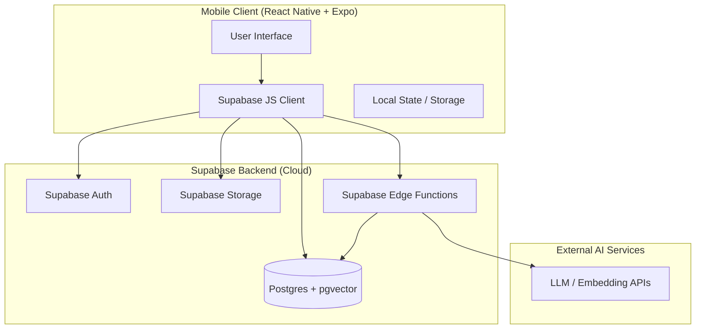
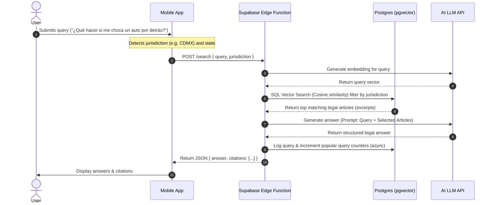

# Architecture Specification: "Tengo Derechos"

This document defines the high-level architecture, components, data flows, and security boundaries for the application.

---

## 1. System Architecture Overview

The system consists of two major layers:
1. **Frontend Mobile Client**: Built with React Native & Expo. Communicates directly with Supabase via the Supabase Client SDK and invokes secure Supabase Edge Functions for AI processing.
2. **Backend Services (Supabase Cloud)**: Provides Postgres Database (with `pgvector` extension), Object Storage, User Authentication, and TypeScript Edge Functions to orchestrate LLMs.

---

## 2. Key Data & Processing Flows

### A. RAG Search Flow (Anonymous or Authenticated)
This pipeline maps user natural-language legal queries to official legal codes using semantic search and Generative AI.

### B. Multimedia Legality Analysis Flow (Authenticated Only)
This flow processes camera and photo library uploads to analyze witnessed incidents.

1. **Permission Check**: App checks if `expo-camera` and `expo-image-picker` permissions are granted. If not, requests them.
2. **Local Capture**: User snaps photo/video or selects from gallery.
3. **Upload**: App uploads raw file directly to a private Supabase Storage bucket (`media-uploads`) using a temporary secure token (signed URL or RLS-validated upload).
4. **Analysis Request**: App calls Edge Function `POST /analyze-media` passing the uploaded file reference and user's context description.
5. **Processing & Moderation**:
   - Edge Function downloads media stream.
   - Blurs faces, license plates, and strips EXIF metadata (using server-side image processing libraries).
   - Sends media + context to a multimodal model (e.g., Gemini 1.5 Pro or GPT-4o) with strict legal instructions.
6. **Report Generation**: Edge Function saves report findings to the `media_analyses` table and returns the analysis JSON back to the app.

---

## 3. Client-Side (React Native / Expo) Configuration

### Core Native Modules
* **`expo-location`**: To identify the user's current Mexican state. If access is denied, the application defaults toCDMX and notifies the user they can manually set their state in settings.
* **`expo-camera`**: For taking photos/videos of legal incidents.
* **`expo-image-picker`**: For selecting photo/video files from the device's library.
* **`@supabase/supabase-js`**: Client SDK to handle Auth and REST queries.
* **`expo-secure-store`**: Securely persists Supabase session tokens (JWTs) on-device.

### Application State Management
* **React Context**: Used to manage light states like User Session, current Location State, and active Theme settings.
* **Zustand**: (Optional fallback) If query history or caching grows complex, Zustand will be utilized for high-performance state management.

---

## 4. Security & Isolation Policies

### Row-Level Security (RLS)
Postgres tables are protected by strict RLS policies:
* **`legal_documents`**: Read-only (`SELECT`) for all users (both `anon` and `authenticated`). No write permissions.
* **`user_profiles`**: Read/write allowed only for the matching `auth.uid()`.
* **`saved_rights`**: Users can `SELECT`, `INSERT`, `DELETE` records where `user_id = auth.uid()`.
* **`media_analyses`**: Users can access only their own uploaded media and associated legal reports (`user_id = auth.uid()`).

### Environment Variables
Sensitive credentials (AI platform API keys, service role keys) are **never** stored inside the React Native application bundle. They are stored securely in Supabase Secrets and accessed exclusively from Edge Functions.
